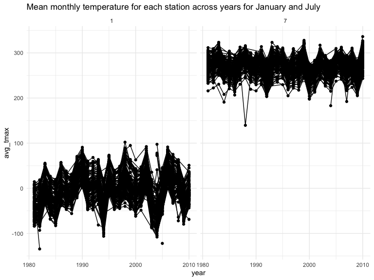
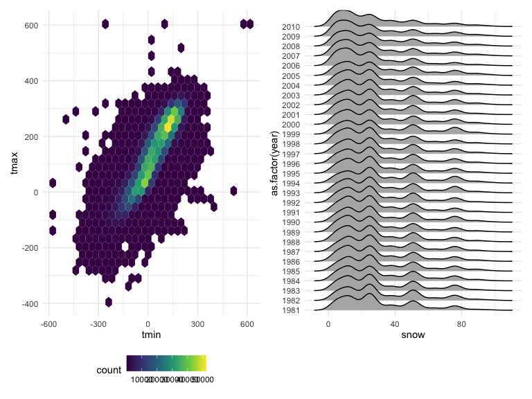
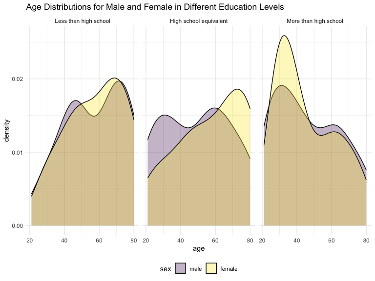
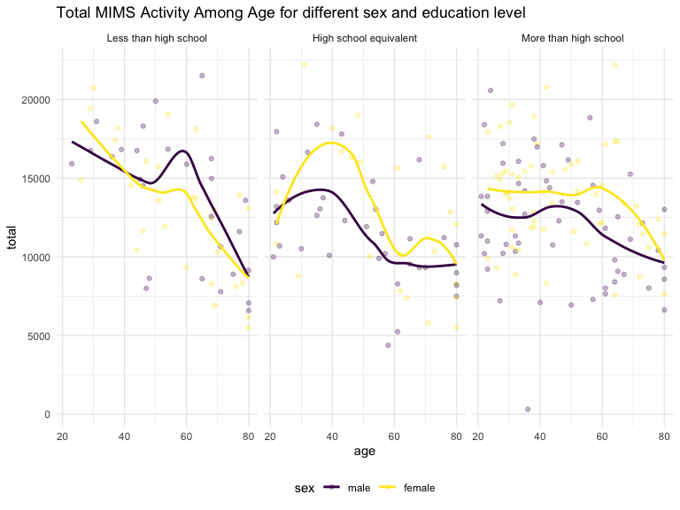
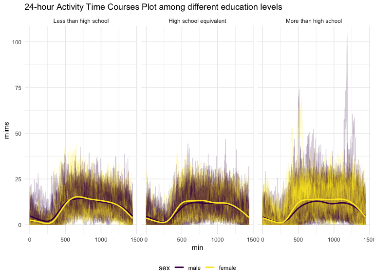
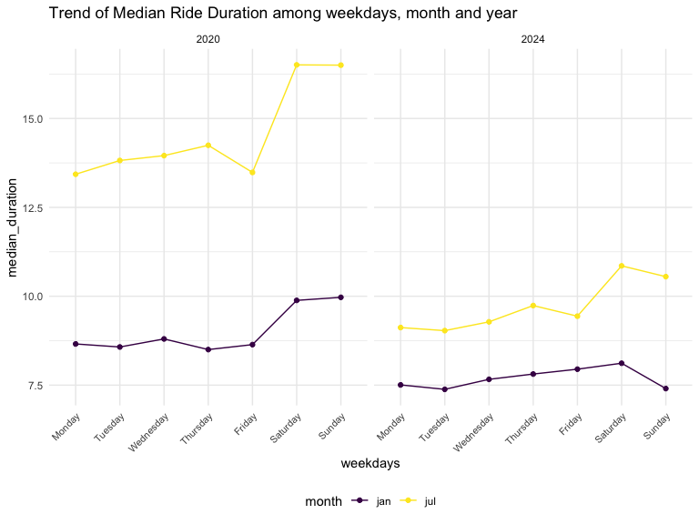

p8105_hw3_cy2752
================
Congyu Yang
2024-10-09

## Problem 1

``` r
data("ny_noaa")

(ny_noaa <- 
  ny_noaa %>% 
  separate(date, into = c("year", "month", "day"),sep = "-") %>% 
  mutate(tmax = as.numeric(tmax),
         tmin = as.numeric(tmin),
         year = as.numeric(year),
         month = as.numeric(month),
         day = as.numeric(day)))
```

    ## # A tibble: 2,595,176 × 9
    ##    id           year month   day  prcp  snow  snwd  tmax  tmin
    ##    <chr>       <dbl> <dbl> <dbl> <int> <int> <int> <dbl> <dbl>
    ##  1 US1NYAB0001  2007    11     1    NA    NA    NA    NA    NA
    ##  2 US1NYAB0001  2007    11     2    NA    NA    NA    NA    NA
    ##  3 US1NYAB0001  2007    11     3    NA    NA    NA    NA    NA
    ##  4 US1NYAB0001  2007    11     4    NA    NA    NA    NA    NA
    ##  5 US1NYAB0001  2007    11     5    NA    NA    NA    NA    NA
    ##  6 US1NYAB0001  2007    11     6    NA    NA    NA    NA    NA
    ##  7 US1NYAB0001  2007    11     7    NA    NA    NA    NA    NA
    ##  8 US1NYAB0001  2007    11     8    NA    NA    NA    NA    NA
    ##  9 US1NYAB0001  2007    11     9    NA    NA    NA    NA    NA
    ## 10 US1NYAB0001  2007    11    10    NA    NA    NA    NA    NA
    ## # ℹ 2,595,166 more rows

``` r
ny_noaa %>% 
  count(snow) %>%
  arrange(desc(n))
```

    ## # A tibble: 282 × 2
    ##     snow       n
    ##    <int>   <int>
    ##  1     0 2008508
    ##  2    NA  381221
    ##  3    25   31022
    ##  4    13   23095
    ##  5    51   18274
    ##  6    76   10173
    ##  7     8    9962
    ##  8     5    9748
    ##  9    38    9197
    ## 10     3    8790
    ## # ℹ 272 more rows

This `ny_noaa` dataset contains 2595176 rows and 9 columns. It includes
variables `id` which is the weather station id, `date` of observation,
precipitation in tenths of mm, snowfall in mm, `snwd` representing
snow_depth in mm, and min and max temperature in tenths of degrees C.  

We clean the data by creating separate variables for `year`, `month`,
and `day` and converting them and `tmax` and `tmin` all to numeric
variables.  
We find that 0 is the most commonly observed value for snowfall by using
`arrange()` function. This is because in NY, it is not likely to snow.  
The second most commonly observed value is NA, indicating missing
values. We can see this dataset miss huge amount of data. Other common
values are 25, 31, 51 and 76, suggesting that snowfall is originally
recorded in fractions of an inch and converted to mm.

``` r
ny_noaa %>% 
  filter(month == 1 | month == 7) %>% 
  group_by(id,month,year) %>% 
  summarize(avg_tmax = mean(tmax,na.rm = T)) %>% 
  ggplot(aes(x = year, y = avg_tmax,group = id)) +
  geom_point() + geom_line()+
  facet_grid(. ~ month)+
  labs(title = "Mean monthly temperature for each station across years for January and July")
```

    ## `summarise()` has grouped output by 'id', 'month'. You can override using the
    ## `.groups` argument.


As we can see, the average temperature in January is lower than that in
July for all stations and among all years, which is under expectation.
And all stations follow almost the same trend in the same month. There
are truly some outliers, we can see the January in 1982 and 2005, it is
much colder than usual; July in 1988 is also unexpected cold.

``` r
tmin_tmax_hex <- ny_noaa %>% 
  ggplot(aes(x = tmin, y = tmax))+
  geom_hex()

snow_ridge <- ny_noaa %>% 
  filter(0<snow & snow < 100) %>% 
  group_by(year) %>% 
  ggplot(aes(x = snow,y = as.factor(year)))+
  geom_density_ridges()

tmin_tmax_hex + snow_ridge
```

    ## Picking joint bandwidth of 3.76


Here are the hex and ridge plot:  
For the hex plot, the majority of the data are centered in the middle
for the distribution(which is shown as the lighter color). In the
relatively rare cases, `tmax` is less than `tmin`, which might be caused
by original data error.  
For the ridge plot, the distribution of each year snowfall are all
multi-peak.  
For most of the stations, we see the snow is between 0 and 35 mm in a
year.  
Then there is a another group of stations that see about 45 mm of snow,
and another group that sees nearly 75 mm.  

## Problem 2

Below I import and clean the participant and accelerator datasets.  
For participant dataset, I first exclude participants who are less than
21 years of age, and those with missing demographic data. And then I
encode data with reasonable variable classes names and also sort them in
order.  
For accelerator dataset, I pivot this dataset longer so that every
`mims` value has its row and we can use these data much convenient.  
And finally, we merge these two datasets together.

``` r
participant_data_origin <- 
  read_csv("hw3_data/nhanes_covar.csv",skip = 4,col_names = T, na = "NA") %>% 
  janitor::clean_names()
```

    ## Rows: 250 Columns: 5
    ## ── Column specification ────────────────────────────────────────────────────────
    ## Delimiter: ","
    ## dbl (5): SEQN, sex, age, BMI, education
    ## 
    ## ℹ Use `spec()` to retrieve the full column specification for this data.
    ## ℹ Specify the column types or set `show_col_types = FALSE` to quiet this message.

``` r
participant_data <- participant_data_origin %>% 
  filter(!is.na(bmi) & !is.na(education)) %>% 
  filter(age >= 21) %>% 
  mutate(sex = as.factor(case_match(sex,1 ~ "male", 2 ~ "female")),
         education = as.factor(case_match(education,
                                1 ~ "Less than high school",
                                2 ~ "High school equivalent",
                                3 ~ "More than high school"))) %>% 
  mutate(sex = factor(sex,levels = c("male","female")),
         education = factor(education,levels = c("Less than high school",
                                       "High school equivalent",
                                       "More than high school")))

accelerometer_data <- 
  read_csv("hw3_data/nhanes_accel.csv")%>% 
  janitor::clean_names()%>%
  pivot_longer(cols = min1:min1440,
               names_to = "min",
               values_to = "mims",
               names_prefix = "min") %>% 
  mutate(min = as.integer(min))
```

    ## Rows: 250 Columns: 1441
    ## ── Column specification ────────────────────────────────────────────────────────
    ## Delimiter: ","
    ## dbl (1441): SEQN, min1, min2, min3, min4, min5, min6, min7, min8, min9, min1...
    ## 
    ## ℹ Use `spec()` to retrieve the full column specification for this data.
    ## ℹ Specify the column types or set `show_col_types = FALSE` to quiet this message.

``` r
joint_acc_df <- left_join(participant_data,accelerometer_data,by = "seqn")
```

``` r
participant_data %>% 
  janitor::tabyl(education,sex) %>% 
  knitr::kable(caption = "Number of Men and Women in Each Education Category")
```

| education              | male | female |
|:-----------------------|-----:|-------:|
| Less than high school  |   27 |     28 |
| High school equivalent |   35 |     23 |
| More than high school  |   56 |     59 |

Number of Men and Women in Each Education Category

From this 2 by 2 table, we can see that for the people participating
this research, in the category `less than high school`, the number of
male and female are almost the same; while in `high school equivalent`
category, there is more male than female; in `more than high school`
category, the number of female is a little bit more than that of male.
This shows that more males tend to proceed a high school equivalent
degree than female, while when going further, the gender difference in
higher degree disappears.

``` r
participant_data %>% 
  ggplot(aes(x = age, fill = sex))+
  geom_density(alpha = 0.3)+
  facet_grid(. ~ education)+
  labs(title = "Age Distributions for Male and Female in Different Education Levels")
```


From this three-panel plot we can see, for the people attending this
research:  
The density distribution of male and female does not appear to have huge
difference in category `less than high school`, there is only a little
bit more female at age between 55 and 70. We can see the distribution is
skewed towards the older individuals, which means that individuals with
lower educational are predominantly older, possibly reflecting that in
previous decades, people have lower access to education .  
In category `High school equivalent`, male people are merged between age
25 to 35 and age 50 to 70. These might be two generation of people. As
we mentioned before, less female is in this category, and the female are
merged at relative older age people.  
For the last category, the density function are pretty alike for male
and female and shows a strong peak in younger age groups for both
genders, with women being slightly more represented. This suggests that
younger individuals are more likely to achieve higher education
nowadays.

``` r
joint_acc_df %>% group_by(seqn,age,sex,education) %>% 
  summarize(total = sum(mims))%>% 
  ggplot(aes(x = age,y = total,color = sex))+
  geom_point(alpha = 0.3)+
  facet_grid(.~education)+
  geom_smooth(se = F)+
  labs(title = "Total MIMS Activity Among Age for different sex and education level")
```

    ## `summarise()` has grouped output by 'seqn', 'age', 'sex'. You can override
    ## using the `.groups` argument.
    ## `geom_smooth()` using method = 'loess' and formula = 'y ~ x'


For all of these plots, we can see there is a trend that as people’s age
get larger, their total MIMS activity value goes down.  
And it is interesting to see that higher education level can help people
to remain at a higher total MIMS activity standard when age goes up.
While lower education level people seems to have a higher total MIMS
activity value when young.  
In the category `Less than high school`, we can see there is a
noticeable decrease in total activity for both gender after 60. For
male, there is a worth mentioning increase in total activity between age
50 to 60. And for people at younger age, women’s activity appears to be
slightly higher than that for men.  
In the category `High School equvient`, female seems to have higher
total activity value than male most of the time. Male’s total activity
value tends to decrease since around 35 years old, and female’s start
around 40.  
For people in category `more than high school`, female seems to have
higher total activity value than male, but female’s total activity drops
relatively quick after age 60. Both male and female show a relatively
stable activity level until about 60 years of age.

``` r
joint_acc_df %>%
  ggplot(aes(x = min,y = mims,color = sex,group =seqn))+
  geom_line(alpha = 0.2)+
  geom_smooth(aes(group = sex),se = F)+
  facet_grid(. ~ education)+
  labs(title = "24-hour Activity Time Courses Plot")
```

    ## `geom_smooth()` using method = 'gam' and formula = 'y ~ s(x, bs = "cs")'


Across all education levels, we can see that there is a peak for
activity levels appearing in the morning for everyone, and remain high
during the day time, while the activity level is pretty low during sleep
time.  
Female generally shows a higher level of activity across all education
levels and especially in `More than high school` category. This may due
to different living habits between different gender.  
What’s more, people in higher education level tend to have more
variability in their activity levels. Among all these plots we can say
education is a influencing factor for physical activity value.  
In the categories, `Less than high school` and `High School equvient`,
there is almost no difference for physical activity value among genders.

## Problem 3

``` r
citi_jan_2020 <- read_csv("hw3_data/citibike/Jan 2020 Citi.csv") %>% 
  janitor::clean_names()%>%
  mutate(date = "jan_2020",
    rideable_type = as.factor(rideable_type),
         weekdays = as.factor(weekdays),
         member_casual = as.factor(member_casual)) %>% 
  select(date,everything())
```

    ## Rows: 12420 Columns: 7
    ## ── Column specification ────────────────────────────────────────────────────────
    ## Delimiter: ","
    ## chr (6): ride_id, rideable_type, weekdays, start_station_name, end_station_n...
    ## dbl (1): duration
    ## 
    ## ℹ Use `spec()` to retrieve the full column specification for this data.
    ## ℹ Specify the column types or set `show_col_types = FALSE` to quiet this message.

``` r
citi_jan_2024 <- read_csv("hw3_data/citibike/Jan 2024 Citi.csv") %>% 
  janitor::clean_names()%>%
  mutate(date = "jan_2024",
    rideable_type = as.factor(rideable_type),
         weekdays = as.factor(weekdays),
         member_casual = as.factor(member_casual))%>% 
  select(date,everything())
```

    ## Rows: 18861 Columns: 7
    ## ── Column specification ────────────────────────────────────────────────────────
    ## Delimiter: ","
    ## chr (6): ride_id, rideable_type, weekdays, start_station_name, end_station_n...
    ## dbl (1): duration
    ## 
    ## ℹ Use `spec()` to retrieve the full column specification for this data.
    ## ℹ Specify the column types or set `show_col_types = FALSE` to quiet this message.

``` r
citi_jul_2020 <- read_csv("hw3_data/citibike/July 2020 Citi.csv") %>% 
  janitor::clean_names()%>%
  mutate(date = "jul_2020",
    rideable_type = as.factor(rideable_type),
         weekdays = as.factor(weekdays),
         member_casual = as.factor(member_casual)) %>% 
  select(date,everything())
```

    ## Rows: 21048 Columns: 7
    ## ── Column specification ────────────────────────────────────────────────────────
    ## Delimiter: ","
    ## chr (6): ride_id, rideable_type, weekdays, start_station_name, end_station_n...
    ## dbl (1): duration
    ## 
    ## ℹ Use `spec()` to retrieve the full column specification for this data.
    ## ℹ Specify the column types or set `show_col_types = FALSE` to quiet this message.

``` r
citi_jul_2024 <- read_csv("hw3_data/citibike/July 2024 Citi.csv") %>% 
  janitor::clean_names()%>%
  mutate(date = "jul_2024",
    rideable_type = as.factor(rideable_type),
         weekdays = as.factor(weekdays),
         member_casual = as.factor(member_casual))%>% 
  select(date,everything())
```

    ## Rows: 47156 Columns: 7
    ## ── Column specification ────────────────────────────────────────────────────────
    ## Delimiter: ","
    ## chr (6): ride_id, rideable_type, weekdays, start_station_name, end_station_n...
    ## dbl (1): duration
    ## 
    ## ℹ Use `spec()` to retrieve the full column specification for this data.
    ## ℹ Specify the column types or set `show_col_types = FALSE` to quiet this message.

``` r
citi_all <- bind_rows(citi_jan_2020,citi_jan_2024,citi_jul_2020,
                      citi_jul_2024)
```

\*\*\* describe the resulting dataset \*\*\*

``` r
citi_all %>% 
  janitor::tabyl(date,member_casual) %>% 
  knitr::kable()
```

| date     | casual | member |
|:---------|-------:|-------:|
| jan_2020 |    984 |  11436 |
| jan_2024 |   2108 |  16753 |
| jul_2020 |   5637 |  15411 |
| jul_2024 |  10894 |  36262 |

``` r
citi_jul_2024 %>% 
  group_by(start_station_name) %>% 
  summarise(frcy = n()) %>% 
  arrange(desc(frcy)) %>% 
  head(5) %>% 
  knitr::kable()
```

| start_station_name       | frcy |
|:-------------------------|-----:|
| Pier 61 at Chelsea Piers |  163 |
| University Pl & E 14 St  |  155 |
| W 21 St & 6 Ave          |  152 |
| West St & Chambers St    |  150 |
| W 31 St & 7 Ave          |  146 |

``` r
citi_all %>% separate(date,into = c("month","year"),sep = "_")%>% 
  mutate(weekdays = factor(weekdays,
                           levels = c("Monday","Tuesday","Wednesday",
                              "Thursday","Friday","Saturday","Sunday"))) %>% 
  group_by(year,month,weekdays) %>% 
  summarise(median_duration = median(duration)) %>% 
  ggplot(aes(x = weekdays, y = median_duration,group = month,color = month))+
  geom_point()+ geom_line()+
  facet_grid(. ~ year )+
  theme(axis.text.x = element_text(size = 8, angle = 45, hjust = 1),
        legend.position = "bottom")
```

    ## `summarise()` has grouped output by 'year', 'month'. You can override using the
    ## `.groups` argument.


\*\*\* Comment \*\*\*

``` r
citi_all %>% filter(date == "jan_2024" | date == "jul_2024") %>% 
  group_by(date,rideable_type,member_casual) %>% 
  ggplot(aes(x = date,y = duration,fill = rideable_type))+
  geom_violin()+
  facet_grid(. ~ member_casual)
```


\*\*\* Comment \*\*\*
