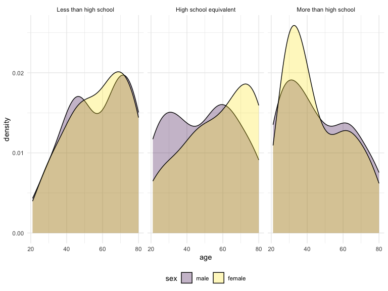

p8105_hw3_cy2752
================
Congyu Yang
2024-10-09

## Problem 1

## Problem 2

``` r
participant_data <- 
  read_csv("hw3_data/nhanes_covar.csv",skip = 4,col_names = T, na = "NA") %>% 
  janitor::clean_names()%>%
  filter(!is.na(bmi) & !is.na(education)) %>% 
  filter(age >= 21) %>% 
  mutate(sex = as.factor(case_match(sex,1 ~ "male", 2 ~ "female")),
         education = as.factor(case_match(education,
                                1 ~ "Less than high school",
                                2 ~ "High school equivalent",
                                3 ~ "More than high school"))) %>% 
  mutate(sex = factor(sex,levels = c("male","female")),
         education = factor(education,levels = c("Less than high school",
                                       "High school equivalent",
                                       "More than high school")))
```

    ## Rows: 250 Columns: 5
    ## ── Column specification ────────────────────────────────────────────────────────
    ## Delimiter: ","
    ## dbl (5): SEQN, sex, age, BMI, education
    ## 
    ## ℹ Use `spec()` to retrieve the full column specification for this data.
    ## ℹ Specify the column types or set `show_col_types = FALSE` to quiet this message.

``` r
accelerometer_data <- 
  read_csv("hw3_data/nhanes_accel.csv")%>% 
  janitor::clean_names()%>%
  pivot_longer(cols = min1:min1440,
               names_to = "min",
               values_to = "mims",
               names_prefix = "min") %>% 
  mutate(min = as.integer(min))
```

    ## Rows: 250 Columns: 1441
    ## ── Column specification ────────────────────────────────────────────────────────
    ## Delimiter: ","
    ## dbl (1441): SEQN, min1, min2, min3, min4, min5, min6, min7, min8, min9, min1...
    ## 
    ## ℹ Use `spec()` to retrieve the full column specification for this data.
    ## ℹ Specify the column types or set `show_col_types = FALSE` to quiet this message.

``` r
joint_acc_df <- left_join(participant_data,accelerometer_data,by = "seqn")

participant_data %>% 
  janitor::tabyl(education,sex) %>% 
  knitr::kable()
```

| education              | male | female |
|:-----------------------|-----:|-------:|
| Less than high school  |   27 |     28 |
| High school equivalent |   35 |     23 |
| More than high school  |   56 |     59 |

``` r
participant_data %>% 
  ggplot(aes(x = education, y = age,fill = sex))+
  geom_boxplot(alpha = 0.3)
```

<!-- -->
\*\*\* Missing Comment \*\*\*

``` r
joint_acc_df %>% group_by(seqn,age,sex,education) %>% 
  summarize(total = sum(mims))%>% 
  ggplot(aes(x = age,y = total,color = sex))+
  geom_point(alpha = 0.3)+
  facet_grid(.~education)+
  geom_smooth(se = F)
```

    ## `summarise()` has grouped output by 'seqn', 'age', 'sex'. You can override
    ## using the `.groups` argument.
    ## `geom_smooth()` using method = 'loess' and formula = 'y ~ x'

<!-- -->
\*\*\* Missing Comment \*\*\*

``` r
joint_acc_df %>% group_by(min,education,sex) %>% 
  summarize(mean_mims = mean(mims)) %>% 
  ggplot(aes(x = min,y = mean_mims,color = sex))+
  geom_point(alpha = 0.3)+
  geom_smooth(se = F)+
  facet_grid(education ~ .)
```

    ## `summarise()` has grouped output by 'min', 'education'. You can override using
    ## the `.groups` argument.
    ## `geom_smooth()` using method = 'gam' and formula = 'y ~ s(x, bs = "cs")'

<!-- -->

\*\*\* Missing Comment \*\*\*

## Problem 3

``` r
citi_jan_2020 <- read_csv("hw3_data/citibike/Jan 2020 Citi.csv") %>% 
  janitor::clean_names()%>%
  mutate(date = "jan_2020",
    rideable_type = as.factor(rideable_type),
         weekdays = as.factor(weekdays),
         member_casual = as.factor(member_casual)) %>% 
  select(date,everything())
```

    ## Rows: 12420 Columns: 7
    ## ── Column specification ────────────────────────────────────────────────────────
    ## Delimiter: ","
    ## chr (6): ride_id, rideable_type, weekdays, start_station_name, end_station_n...
    ## dbl (1): duration
    ## 
    ## ℹ Use `spec()` to retrieve the full column specification for this data.
    ## ℹ Specify the column types or set `show_col_types = FALSE` to quiet this message.

``` r
citi_jan_2024 <- read_csv("hw3_data/citibike/Jan 2024 Citi.csv") %>% 
  janitor::clean_names()%>%
  mutate(date = "jan_2024",
    rideable_type = as.factor(rideable_type),
         weekdays = as.factor(weekdays),
         member_casual = as.factor(member_casual))%>% 
  select(date,everything())
```

    ## Rows: 18861 Columns: 7
    ## ── Column specification ────────────────────────────────────────────────────────
    ## Delimiter: ","
    ## chr (6): ride_id, rideable_type, weekdays, start_station_name, end_station_n...
    ## dbl (1): duration
    ## 
    ## ℹ Use `spec()` to retrieve the full column specification for this data.
    ## ℹ Specify the column types or set `show_col_types = FALSE` to quiet this message.

``` r
citi_jul_2020 <- read_csv("hw3_data/citibike/July 2020 Citi.csv") %>% 
  janitor::clean_names()%>%
  mutate(date = "jul_2020",
    rideable_type = as.factor(rideable_type),
         weekdays = as.factor(weekdays),
         member_casual = as.factor(member_casual)) %>% 
  select(date,everything())
```

    ## Rows: 21048 Columns: 7
    ## ── Column specification ────────────────────────────────────────────────────────
    ## Delimiter: ","
    ## chr (6): ride_id, rideable_type, weekdays, start_station_name, end_station_n...
    ## dbl (1): duration
    ## 
    ## ℹ Use `spec()` to retrieve the full column specification for this data.
    ## ℹ Specify the column types or set `show_col_types = FALSE` to quiet this message.

``` r
citi_jul_2024 <- read_csv("hw3_data/citibike/July 2024 Citi.csv") %>% 
  janitor::clean_names()%>%
  mutate(date = "jul_2024",
    rideable_type = as.factor(rideable_type),
         weekdays = as.factor(weekdays),
         member_casual = as.factor(member_casual))%>% 
  select(date,everything())
```

    ## Rows: 47156 Columns: 7
    ## ── Column specification ────────────────────────────────────────────────────────
    ## Delimiter: ","
    ## chr (6): ride_id, rideable_type, weekdays, start_station_name, end_station_n...
    ## dbl (1): duration
    ## 
    ## ℹ Use `spec()` to retrieve the full column specification for this data.
    ## ℹ Specify the column types or set `show_col_types = FALSE` to quiet this message.

``` r
citi_all <- bind_rows(citi_jan_2020,citi_jan_2024,citi_jul_2020,
                      citi_jul_2024)
```

\*\*\* describe the resulting dataset \*\*\*

``` r
citi_all %>% group_by(date,member_casual) %>% 
  summarize(frcy = n()) %>% 
  pivot_wider(names_from = "member_casual",
              values_from = "frcy") %>% 
  knitr::kable()
```

    ## `summarise()` has grouped output by 'date'. You can override using the
    ## `.groups` argument.

| date     | casual | member |
|:---------|-------:|-------:|
| jan_2020 |    984 |  11436 |
| jan_2024 |   2108 |  16753 |
| jul_2020 |   5637 |  15411 |
| jul_2024 |  10894 |  36262 |

``` r
citi_jul_2024 %>% 
  group_by(start_station_name) %>% 
  summarise(frcy = n()) %>% 
  arrange(desc(frcy)) %>% 
  head(5) %>% 
  knitr::kable()
```

| start_station_name       | frcy |
|:-------------------------|-----:|
| Pier 61 at Chelsea Piers |  163 |
| University Pl & E 14 St  |  155 |
| W 21 St & 6 Ave          |  152 |
| West St & Chambers St    |  150 |
| W 31 St & 7 Ave          |  146 |

``` r
citi_all %>% separate(date,into = c("month","year"),sep = "_")%>% 
  mutate(weekdays = factor(weekdays,
                           levels = c("Monday","Tuesday","Wednesday",
                              "Thursday","Friday","Saturday","Sunday"))) %>% 
  group_by(year,month,weekdays) %>% 
  summarise(median_duration = median(duration)) %>% 
  ggplot(aes(x = weekdays, y = median_duration,color = year,group = year))+
  geom_point()+ geom_line()+
  facet_grid(.~month,labeller = as_labeller(c("jan" = "January","jul" = "July")))+
  theme(axis.text.x = element_text(size = 8, angle = 45, hjust = 1),
        legend.position = "bottom")
```

    ## `summarise()` has grouped output by 'year', 'month'. You can override using the
    ## `.groups` argument.

<!-- -->
\*\*\* Comment \*\*\*

``` r
citi_all %>% filter(date == "jan_2024" | date == "jul_2024") %>% 
  group_by(date,rideable_type,member_casual) %>% 
  ggplot(aes(x = date,y = duration,fill = rideable_type))+
  geom_boxplot()+
  facet_grid(. ~ member_casual)
```

<!-- -->

\*\*\* Comment \*\*\*
